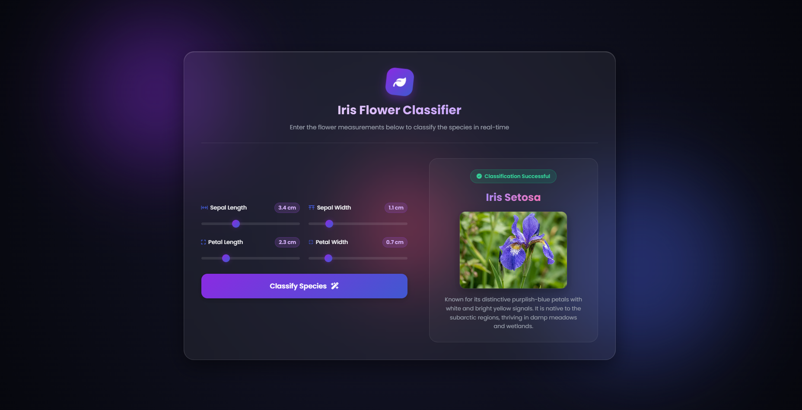
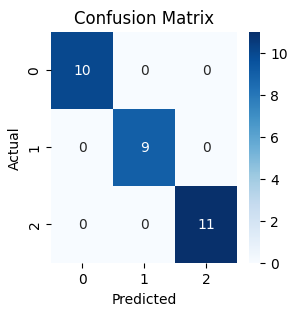
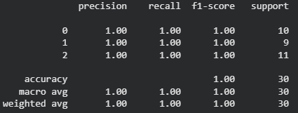

# 🌸 Iris Flower Classification 

A Machine Learning-powered web application that predicts the species of an Iris flower based on sepal and petal measurements. The application is built using Flask and Scikit-learn to provide real-time classification of Iris flower species.


## 🖥️ Application Preview

<p align="center">
  
</p>

---

## 🚀 Live Demo

🔗 **Live Application:** https://iris-flower-classification-theta.vercel.app

---

## 📌 Project Overview

The Iris Flower Classification Web App classifies Iris flowers into one of three species:

* **Iris Setosa**
* **Iris Versicolor**
* **Iris Virginica**

The prediction is based on four flower measurements:

* Sepal Length (cm)
* Sepal Width (cm)
* Petal Length (cm)
* Petal Width (cm)

Users can input these measurements through an intuitive web interface and instantly receive the predicted flower species.

---

## ✨ Features

✅ User-friendly and responsive interface
✅ Real-time Iris species prediction
✅ Interactive and modern UI design
✅ Flower image display based on prediction
✅ Multiple machine learning models evaluated
✅ Fully deployed and accessible online

---

## 🛠️ Tech Stack

### Frontend

* HTML5
* CSS3

### Backend

* Python
* Flask

### Machine Learning

* Scikit-learn
* NumPy
* Pandas

### Deployment

* Vercel

---

## 📊 Dataset

The project uses the famous **Iris Dataset**, originally introduced by Ronald Fisher.

### Dataset Features

| Feature      | Description                    |
| ------------ | ------------------------------ |
| Sepal Length | Length of sepal in centimeters |
| Sepal Width  | Width of sepal in centimeters  |
| Petal Length | Length of petal in centimeters |
| Petal Width  | Width of petal in centimeters  |

### Target Classes

* Iris Setosa
* Iris Versicolor
* Iris Virginica

---

## 🧠 Machine Learning Workflow

1. Data Collection and Loading
2. Exploratory Data Analysis (EDA)
3. Data Preprocessing
4. Correlation Analysis
5. Label Encoding
6. Train-Test Split
7. Model Training
8. Model Evaluation
9. Model Deployment

---

## 🤖 Models Used

The following machine learning algorithms were trained and evaluated:

* Logistic Regression
* K-Nearest Neighbors (KNN)
* Decision Tree Classifier

### 📈 Model Performance

| Model                    | Accuracy |
| ------------------------ | -------- |
| Logistic Regression      | 100%     |
| K-Nearest Neighbors      | 96.67%   |
| Decision Tree Classifier | 96.67%   |

**Logistic Regression** achieved the highest accuracy and was selected for deployment.

---

## 🔥 Confusion Matrix

<p align="center">
  
</p>

---

## 📋 Classification Report

<p align="center">
  
</p>

---

## 📂 Project Structure

```text
Iris-Flower-Classification/
│
├── app.py
├── model.pkl
├── requirements.txt
├── .gitignore
│
├── templates/
│   └── index.html
│
├── static/
│   ├── images/
│   └── style.css
│
└── README.md
```

---

## ⚙️ Installation and Setup

### Clone the Repository

```bash
git clone https://github.com/SandeepKumarSha/Iris-Flower-Classification.git
```

### Navigate to the Project Directory

```bash
cd Iris-Flower-Classification
```

### Create a Virtual Environment (Optional)

```bash
python -m venv myenv
```

### Activate Virtual Environment

**Windows**

```bash
myenv\Scripts\activate
```

### Install Dependencies

```bash
pip install -r requirements.txt
```

### Run the Application

```bash
python app.py
```

Open your browser and visit:

```bash
http://127.0.0.1:5000
```

---

## 🎯 Future Enhancements

* Implement additional machine learning models
* Add model comparison dashboard
* Integrate interactive data visualizations
* Support dark and light themes

---

## 👨‍💻 Author

### Sandeep Kumar Sha


* GitHub: https://github.com/SandeepKumarSha
* LinkedIn: https://www.linkedin.com/in/sandeepkumarsha
